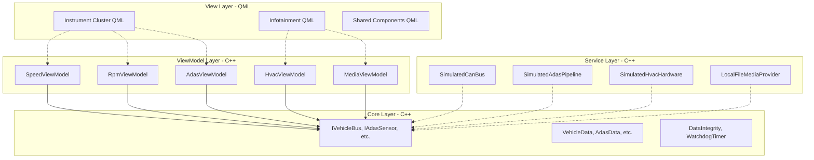

# 🏛️ Architecture & Design Document

This document outlines the architectural decisions, design patterns, and functional safety mechanisms implemented in the Automotive HMI Dashboard.

---

## 1. System Overview

The HMI Dashboard is designed to be a unified interface running on a vehicle's primary display, merging the **Instrument Cluster** (safety-critical) and **Infotainment** (non-critical) into a single screen.

To guarantee high performance and strict safety separation, the system follows a 4-tier **Layered Architecture** leveraging the **Model-View-ViewModel (MVVM)** pattern.

### Layer Diagram

---

## 2. SOLID Principles Implementation

The architecture was explicitly designed to adhere to SOLID principles to ensure maintainability, testability, and scalability over a vehicle's 10-15 year lifecycle.

### S - Single Responsibility Principle (SRP)
Every class has exactly one reason to change.
- `DataIntegrity`: Only calculates and validates CRC-8 and alive-counters.
- `SpeedViewModel`: Only manages speed-related UI state (km/h vs mph conversion).
- `SimulatedCanBus`: Only generates simulated vehicle telemetry.

### O - Open/Closed Principle (OCP)
The system is open for extension but closed for modification.
- **Media Providers**: You can add `BluetoothMediaProvider` by implementing `IMediaProvider`. No existing media playback logic in `MediaPlayerViewModel` or `MediaPlayer.qml` needs to change.
- **ADAS Strategies**: `YoloProcessingStrategy` and `BasicProcessingStrategy` implement `IAdasProcessingStrategy`. New algorithms can be added without modifying the perception pipeline or the UI.

### L - Liskov Substitution Principle (LSP)
Subclasses must be substitutable for their base classes.
- `SimulatedAdasPipeline` implements `IAdasSensor`. A `RealCameraAdasSensor` could be substituted in `main.cpp` without any changes to the `AdasViewModel`, as both fulfill the contract perfectly.

### I - Interface Segregation Principle (ISP)
Clients should not be forced to depend on interfaces they do not use.
- Instead of a monolithic `IVehicleDataObserver`, the system defines narrow interfaces:
  - `IVehicleSpeedObserver`
  - `IVehicleRpmObserver`
  - `ITellTaleObserver`

### D - Dependency Inversion Principle (DIP)
High-level modules should not depend on low-level modules; both should depend on abstractions.
- ViewModels (High-level) depend only on `src/core/` interfaces (Abstractions).
- Services (Low-level) implement `src/core/` interfaces (Abstractions).
- The `main.cpp` composition root injects the concrete Services into the ViewModels.

---

## 3. Design Patterns Catalog

| Pattern | Location | Problem Solved |
|---------|----------|----------------|
| **MVVM** | `src/viewmodels/` | Decouples UI layout/styling (QML) from business logic and data formatting (C++). Allows independent testing of ViewModels. |
| **Observer** | `main.cpp` (Qt Signals/Slots) | ViewModels passively listen to hardware services for updates without polling. Enables the 1-to-many relationship of data streams. |
| **Strategy** | `IAdasProcessingStrategy` | Allows hot-swapping ADAS processing algorithms (e.g., YOLO NMS vs Basic Radar thresholding) depending on vehicle trim or active sensor suite. |
| **State** | `DashboardStateManager` | Manages complex, mutually exclusive dashboard modes (Normal, Sport, Parking, SafeMode) encapsulating transition logic and UI styling tokens. |
| **Dependency Injection** | `main.cpp` | Centralizes creation and wiring of objects, avoiding Singletons (except for stateless QML styling) and making the system highly testable. |

---

## 4. Functional Safety (ISO 26262)

The system incorporates several features required for safety-critical automotive software (ASIL B/C).

### ASIL / QM Separation
- **ASIL Components** (Instrument Cluster, Speed, Tell-tales) are isolated in the `HmiDashboard.Cluster` QML module.
- **QM Components** (Media, HVAC, Settings) are in the `HmiDashboard.Infotainment` module.
- If the Infotainment module crashes or hangs, the Instrument Cluster remains fully operational.

### Data Integrity (E2E Protection)
All incoming telemetry data from the `IVehicleBus` is validated before being consumed by the ViewModels.
- **CRC-8 Checksums**: Uses the SAE J1850 polynomial (`0x1D`) to ensure data hasn't been corrupted in transit.
- **Alive Counters**: A 4-bit rolling counter (`0-15`) ensures messages are not stale, repeated, or dropped.

*Implementation: `src/core/src/DataIntegrity.cpp`*

### Software Watchdog
A thread-safe watchdog timer monitors the GUI thread to ensure the UI hasn't frozen.
- The Watchdog runs on its own background `QThread`.
- The GUI thread must "kick" (reset) the watchdog every 100ms.
- If the watchdog expires (500ms timeout), it triggers an immediate fallback to **Safe Mode**.

*Implementation: `src/core/src/WatchdogTimer.cpp` and `src/viewmodels/WatchdogManager.cpp`*

### Safe State Fallback
If `DashboardStateManager::activateSafeMode()` is triggered, the UI aggressively degrades:
- The Infotainment panel is completely hidden.
- The Instrument Cluster expands to 100% width.
- Graphical gauges are replaced with a high-contrast, text-only display to minimize GPU load and rendering complexity, ensuring critical speed and warning data remains visible.

---

## 5. CMake & Build Architecture

The build system follows the latest Qt 6 best practices:
1. `qt_standard_project_setup()` is used for modern compiler flags and directory structures.
2. The project is split into granular CMake targets: `hmi_core`, `hmi_services`, `hmi_viewmodels`.
3. QML is compiled ahead-of-time (AOT) using the `qt_add_qml_module` API, ensuring strong typing, fast startup, and native C++ performance for QML bindings.
4. The `QML_ELEMENT` macro is used in C++ ViewModels, completely replacing the legacy `qmlRegisterType` approach.
